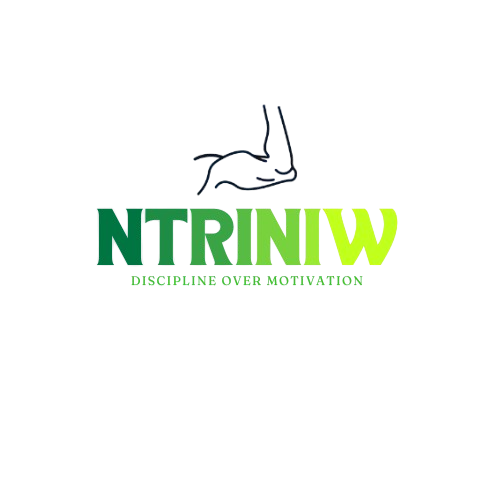

<div align="center">
  
  
  # Ntriniw
  
  **The Ultimate Social Platform for Calisthenics Enthusiasts**
  
  [](https://flutter.dev/)
  [](https://www.djangoproject.com/)
  [](https://www.mysql.com/)
  [](https://opensource.org/licenses/MIT)
  
  [](https://github.com/YassineFaidi/Ntriniw/stargazers)
  [](https://github.com/YassineFaidi/Ntriniw/network)
  [](https://github.com/YassineFaidi/Ntriniw/issues)
  [](https://github.com/YassineFaidi/Ntriniw/pulls)
</div>

---

## 📱 Screenshots

<div align="center">
  
  
</div>

---

## 🚀 About Ntriniw

**Ntriniw** is a revolutionary social mobile application designed exclusively for the calisthenics community. Think Instagram meets fitness, but with features tailored specifically for bodyweight training enthusiasts. Our platform empowers athletes to share their journey, connect with like-minded individuals, and build a supportive community around calisthenics.

### ✨ Key Features

| Feature | Description |
|---------|-------------|
| 📸 **Post Sharing** | Upload high-quality images and videos of your calisthenics progress |
| ❤️ **Like & Comment** | Engage with the community through interactive features |
| 💬 **Real-time Chat** | Connect directly with other athletes and share tips |
| 👥 **User Profiles** | View and manage user profiles with custom images |
| 📊 **Story System** | Share temporary 24-hour stories like Instagram |
| 🏆 **Social Interaction** | Follow, like, comment, and message other users |

### 🎯 Mission

Our mission is to create the world's most vibrant and supportive online community for calisthenics enthusiasts. We believe that sharing progress, celebrating achievements, and connecting with fellow athletes is the key to staying motivated and reaching your fitness goals.

---

## 🛠️ Tech Stack

### Frontend
- **Flutter** (3.4.3+) - Cross-platform mobile development framework
- **Dart** - Programming language for Flutter
- **Provider** - State management solution
- **Shared Preferences** - Local data storage
- **Image Picker** - Image selection and capture
- **HTTP** - API communication
- **Cached Network Image** - Efficient image loading and caching
- **Story View** - Story display functionality
- **Google Fonts** - Custom typography

### Backend
- **Django** (4.2+) - High-level Python web framework
- **Django REST Framework** - Powerful toolkit for building Web APIs
- **Python** (3.8+) - Backend programming language
- **MySQL** - Reliable and scalable relational database
- **bcrypt** - Password hashing and security

### Database Schema
- **Users** - User authentication and profiles
- **Posts** - User-generated content with images
- **Stories** - 24-hour temporary content
- **Likes** - Post interaction tracking
- **Comments** - Post discussion system
- **Messages** - Direct messaging between users

---

## 🚀 Getting Started

### Prerequisites

- **Flutter SDK** (3.4.3 or higher)
- **Python** (3.8 or higher)
- **MySQL** (8.0 or higher)
- **Android Studio** / **VS Code** with Flutter extensions
- **Git** for version control

### Installation

1. **Clone the repository**
   ```bash
   git clone https://github.com/YassineFaidi/Ntriniw.git
   cd Ntriniw
   ```

2. **Database Setup**
   ```bash
   # Start MySQL service
   sudo service mysql start  # Linux/Mac
   # or
   net start mysql  # Windows
   
   # Access MySQL and run the database script
   mysql -u root -p
   source django_backend/main/databasesQuery.sql
   ```

3. **Backend Setup**
   ```bash
   cd django_backend
   
   # Create virtual environment
   python -m venv venv
   
   # Activate virtual environment
   # On Windows:
   venv\Scripts\activate
   # On macOS/Linux:
   source venv/bin/activate
   
   # Install dependencies
   pip install django
   pip install mysqlclient
   pip install bcrypt
   
   # Run migrations
   python manage.py migrate
   
   # Start the server (default port 8000)
   python manage.py runserver 0.0.0.0:1234
   ```

4. **Frontend Setup**
   ```bash
   cd flutter_frontend
   
   # Get dependencies
   flutter pub get
   
   # Update API endpoints (if needed)
   # Edit lib/constants/api_endpoints.dart with your server IP
   
   # Run the app
   flutter run
   ```

### Configuration

#### Backend Configuration
Update `django_backend/django_backend/settings.py` with your database credentials:

```python
DATABASES = {
    'default': {
        'ENGINE': 'django.db.backends.mysql',
        'NAME': 'Ntriniw_v1',
        'USER': 'your_username',
        'PASSWORD': 'your_password',
        'HOST': 'localhost',
        'PORT': '3306', 
    }
}
```

#### Frontend Configuration
Update `flutter_frontend/lib/constants/api_endpoints.dart` with your server IP:

```dart
const serverIp = 'your_server_ip';  // Change this to your server IP
const serverPort = '1234';
```

### Environment Variables

Create a `.env` file in the `django_backend` directory:

```env
DEBUG=True
SECRET_KEY=your-secret-key-here
DATABASE_NAME=Ntriniw_v1
DATABASE_USER=your_username
DATABASE_PASSWORD=your_password
DATABASE_HOST=localhost
DATABASE_PORT=3306
```

---

## 📱 Usage Guide

1. **Sign Up** - Create your athlete profile with email, username, and optional profile image
2. **Sign In** - Access your account with email and password
3. **Upload Content** - Share your calisthenics progress with photos and text
4. **Engage** - Like, comment, and interact with the community
5. **Share Stories** - Post temporary 24-hour stories
6. **Chat** - Send direct messages to other users
7. **View Profiles** - Explore other athletes' profiles and posts
   
---

## 🤝 Contributing

We welcome contributions from the community! Here's how you can help:

1. **Fork the repository**
2. **Create a feature branch** (`git checkout -b feature/AmazingFeature`)
3. **Commit your changes** (`git commit -m 'Add some AmazingFeature'`)
4. **Push to the branch** (`git push origin feature/AmazingFeature`)
5. **Open a Pull Request**

### Development Guidelines
- Follow Flutter and Django best practices
- Write comprehensive tests for new features
- Update documentation as needed
- Ensure code quality with linting
- Test on both Android and iOS platforms
- Follow the existing code style and architecture

### Code Style
- Use meaningful variable and function names
- Add comments for complex logic
- Follow PEP 8 for Python code
- Use Flutter's recommended coding standards
- Keep functions small and focused

---

## 📊 Project Status

### ✅ Completed Features
- [x] User authentication system (sign up/sign in)
- [x] Post creation and sharing with images
- [x] Like and comment functionality
- [x] Story creation and viewing (24-hour expiry)
- [x] Direct messaging between users
- [x] User profile management
- [x] Real-time post interactions
- [x] Image upload and storage
- [x] Cross-platform mobile app (Android/iOS)

### 🚧 In Progress
- [ ] Push notifications
- [ ] Video upload support
- [ ] Advanced search functionality
- [ ] User following system

### 📋 Planned Features
- [ ] Advanced analytics dashboard
- [ ] Video compression and optimization
- [ ] Offline mode support
- [ ] Live streaming capabilities
- [ ] AI-powered workout recommendations
- [ ] Integration with fitness trackers
- [ ] Advanced community features and challenges

---

## 🛡️ Security

- Passwords are hashed using bcrypt
- CSRF protection enabled
- Input validation on all endpoints
- SQL injection prevention through parameterized queries
- Secure file upload handling

---

## 📄 License

This project is licensed under the MIT License - see the [LICENSE](LICENSE) file for details.

---

## 👨‍💻 Team

<div align="center">
  
  **Yassine Faidi** - *Lead Developer*
  
  [](https://www.linkedin.com/in/yassine-faidi-853671247/)
  [](mailto:yassine.faidi.117@gmail.com)
  [](https://github.com/YassineFaidi)
  
</div>

---

## 🙏 Acknowledgments

- The amazing calisthenics community for inspiration
- Flutter and Django communities for excellent documentation
- All contributors and beta testers
- Open source contributors whose libraries made this project possible

---

## 📞 Support

If you encounter any issues or have questions:

- **Create an issue** on GitHub
- **Email us** at yassine.faidi.1173@gmail.com
- **Join our Discord** community

---

<div align="center">
  
  **Made with ❤️ for the Calisthenics Community**
  
  [](https://github.com/YassineFaidi/Ntriniw)
  [](https://github.com/YassineFaidi/Ntriniw/issues)
  [](https://github.com/YassineFaidi/Ntriniw/stargazers)
  
</div> 
