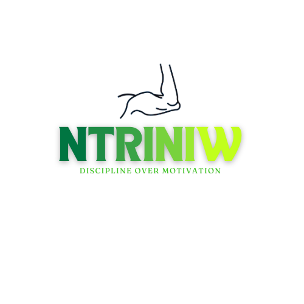

 

  

  <h3 align="center">Ntriniw</h3>

  

    A social mobile app for the calisthenics community with Instagram-like features.
     
     
    <a href=".">View Demo</a>
    <a href=".">Report Bug</a>
    <a href=".">Request Feature</a>
  

  
Table of Contents

  <ol>
    <li>
      <a href="#about-the-project">About The Project</a>
      <ul>
        <li><a href="#built-with">Built With</a></li>
      </ul>
    </li>
    <li><a href="#usage">Usage</a></li>
    <li><a href="#license">License</a></li>
    <li><a href="#contact">Contact</a></li>
  </ol>

## About The Project

  

Ntriniw is a social mobile app dedicated to the calisthenics community, offering Instagram-like features tailored for fitness enthusiasts. It allows users to share workouts, engage with posts, and connect with other athletes.

Key features include:
* **Post sharing** – Users can upload images, videos, and captions about their calisthenics journey.
* **Like & Comment system** – Engage with posts through likes and comments.
* **Real-time chat** – Connect and interact with other community members.

This project aims to foster a strong online calisthenics community by providing a platform for sharing progress, motivation, and knowledge.

### Demo Video

  

(<a href="#readme-top">back to top</a>)

### Built With

* **Flutter** (Frontend)
* **Django** (Backend)
* **MySQL** (Database)

(<a href="#readme-top">back to top</a>)

## Usage

* Sign up and create a profile.
* Upload workout images and videos.
* Like and comment on other users' posts.
* Follow other athletes to see their updates.
* Use the chat feature to connect with the community.

(<a href="#readme-top">back to top</a>)

## License

Distributed under the MIT License. See `LICENSE.txt` for more information.

(<a href="#readme-top">back to top</a>)

## Contact

Yassine Faidi: [@my_linkedin](https://www.linkedin.com/in/yassine-faidi-853671247/) - yassinefaidi133@gmail.com

Project Link: [https://github.com/YassineFaidi/Ntriniw.git](https://github.com/YassineFaidi/Ntriniw.git)

(<a href="#readme-top">back to top</a>)

